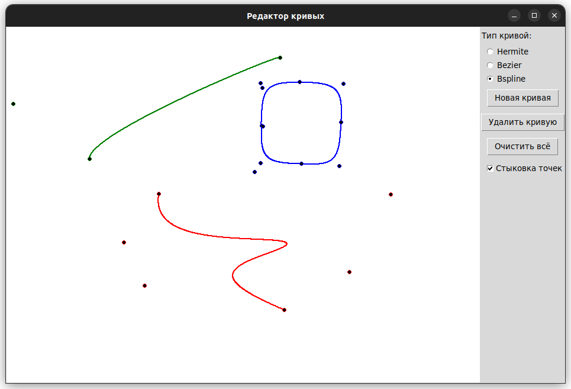
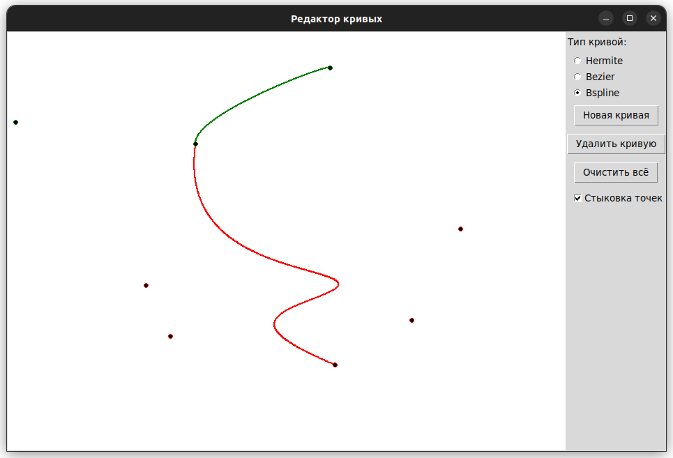

# Лабораторная работа №3 по дисциплине "Графический Интерфейс Интеллектуальных Систем"  
**Тема:** алгоритмы построения параметрических кривых.

**Выполнил:** Глёза Егор Дмитриевич.

## Цель работы
Разработка графического редактора для построения и редактирования параметрических кривых:
- **Кривая Эрмита**
- **Кривая Безье**
- **B-сплайн**

Реализация матричных вычислений и интерактивного управления контрольными точками.

---

## Реализованные функции
1. **Построение параметрических кривых**  
   - Выбор типа кривой через радио-кнопки
   - Интерактивное добавление и перемещение контрольных точек
   - Автоматическая перерисовка при изменении точек

2. **Управление кривыми**  
   - Создание новой кривой
   - Удаление активной кривой
   - Очистка всего холста
   - Стыковка точек разных кривых

3. **Матричные вычисления**  
   - Класс `Matrix` для операций с матрицами
   - Оптимизированные алгоритмы умножения матриц
   - Поддержка транспонирования

---

## Описание алгоритмов

### 1. Кривая Эрмита
**Принцип работы:**  
- Использует 4 точки: $P_0$, $P_1$ (позиции) и $P_2$, $P_3$ (касательные)
- Матрица коэффициентов Эрмита:
$$ M = \begin{bmatrix}
2 & -2 & 1 & 1 \\
-3 & 3 & -2 & -1 \\
0 & 0 & 1 & 0 \\
1 & 0 & 0 & 0
\end{bmatrix} $$

### 2. Кривая Безье
**Особенности:**  
- Использует полиномы Бернштейна
- Поддерживает произвольное количество контрольных точек
- Гарантирует прохождение через первую и последнюю точки

**Формула:**  
$$ P(t) = \sum_{i=0}^n \binom{n}{i} (1-t)^{n-i} t^i P_i $$

### 3. B-сплайн
**Характеристики:**  
- Равномерный кубический B-сплайн
- Матрица коэффициентов:
$$ M = \frac{1}{6}
\begin{bmatrix} 
-1 & 3 & -3 & 1 \\
3 & -6 & 3 & 0 \\
-3 & 0 & 3 & 0 \\
1 & 4 & 1 & 0
\end{bmatrix} $$

---

## Структура проекта
```
.
├── main.py             # Точка входа
├── geometry.py         # Классы Point и Matrix
├── editor.py          # Класс CurveEditor (GUI)
└── curves/            # Модуль кривых
    ├── __init__.py    
    ├── base.py        # Базовый класс Curve
    ├── hermite.py     # Кривая Эрмита
    ├── bezier.py      # Кривая Безье
    └── bspline.py     # B-сплайн
```

---

## Инструкция по использованию
1. **Запуск программы**  
```bash
python main.py
```

2. **Создание кривой**  
   - Выберите тип кривой (Эрмит/Безье/B-сплайн)
   - Нажмите "Новая кривая"
   - Добавляйте точки левым кликом мыши

3. **Редактирование**  
   - Перетаскивайте точки левой кнопкой мыши
   - Выбирайте активную кривую правым кликом
   - Включите "Стыковка точек" для соединения кривых

---

## Пример работы
**Кривые разных типов:**  


**Стыковка кривых:**  


---

## Математическое описание

### Матричные вычисления
Для всех кривых используется общая формула:
$$ P(t) = T \cdot M \cdot G $$
где:
- $T = [t^3, t^2, t, 1]$ — вектор параметра
- $M$ — матрица коэффициентов (зависит от типа кривой)
- $G$ — геометрическая матрица контрольных точек

### Особенности реализации
1. **Кривая Эрмита:**
   - Ограничение на 4 точки
   - Масштабирование касательных векторов

2. **Кривая Безье:**
   - Прямая формула через полиномы Бернштейна
   - Динамическое количество точек

3. **B-сплайн:**
   - Сегментация на участки по 4 точки
   - Локальный параметр t для каждого сегмента

---

## Заключение
В ходе работы были реализованы три типа параметрических кривых с учётом их математических особенностей:
- Кривая Эрмита: удобна для задания через касательные
- Кривая Безье: интуитивное управление формой
- B-сплайн: локальный контроль и непрерывность производных

Редактор демонстрирует основные принципы работы с параметрическими кривыми и может быть расширен дополнительными инструментами редактирования и типами кривых.
